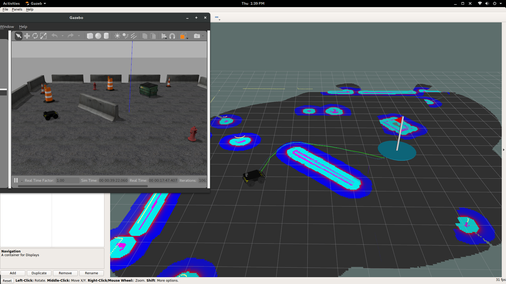

The Husky ground rover is not supported by default on ROS Kinetic. Fortunately, however, the source code is available for download, compilation and installation into ROS. The following script does just that. Don't forget to run `chmod +x install-husky.sh` before executing the script in the terminal.

##### [install-husky.sh](install-husky.sh)

```sh
echo -e "\033[32m ----------Creating Workspace----------\033[0m"
mkdir ~/Documents/husky_kinetic
cd ~/Documents/husky_kinetic
wget https://raw.githubusercontent.com/CSUN-SERL/ISLURPDevguide/master/kinetic-husky-wet.rosinstall

echo -e "\033[32m ----------Downloading Source Code----------\033[0m"
# Get the source code
wstool init src kinetic-husky-wet.rosinstall

echo -e "\033[32m ----------Installing Dependencies----------\033[0m"
# Install Dependencies (ignore errors)
rosdep install --from-paths src --ignore-src --rosdistro kinetic -y -r

# Setup the catkin workspace
cd src
catkin_init_workspace
cd ..
catkin_make

echo "source ~/Documents/husky_kinetic/devel/setup.bash" >> ~/.bashrc
source ~/.bashrc
echo -e "\033[32m ----------DONE----------\033[0m"
```

To ensure that everything works as intended after the script has finished, follow the [Husky Move Base Demo](http://wiki.ros.org/husky_navigation/Tutorials/Husky%20Move%20Base%20Demo). You should see something similar to the following picture:


